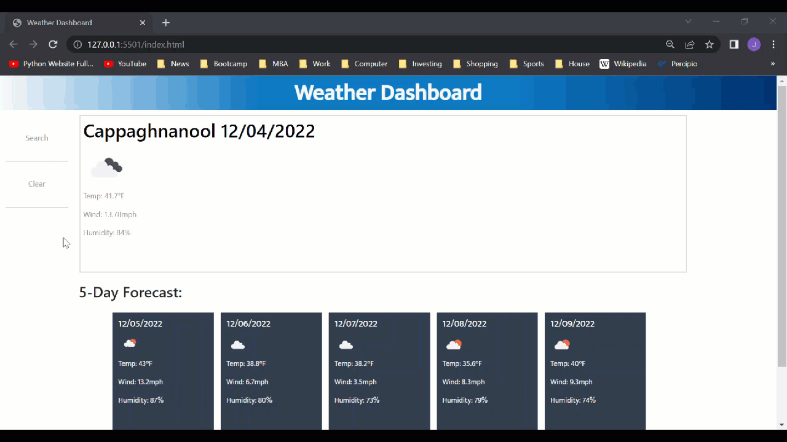

# Weather Dashboard

## Developer: Josh Lutz

## Description

```
This project is an exercise in pulling third-party API information related to weather information that can
be used to understand what the current weather is for a selected city and render it on a page. The ability to
store a searched city in localStorage will show what recent cities have been searched for and what the 5-day
forecast is.
```

## User Story

```
AS A traveler
I WANT to see the weather outlook for multiple cities
SO THAT I can plan a trip accordingly
```

## Acceptance Criteria

* GIVEN a weather dashboard with form inputs
* WHEN I search for a city
* THEN I am presented with current and future conditions for that city and that city is added to the search history
* WHEN I view current weather conditions for that city
* THEN I am presented with the city name, the date, an icon representation of weather conditions, the temperature, the humidity, and the wind speed
* WHEN I view future weather conditions for that city
* THEN I am presented with a 5-day forecast that displays the date, an icon representation of weather conditions, the temperature, the wind speed, and the humidity
* WHEN I click on a city in the search history
* THEN I am again presented with current and future conditions for that city

## Deployed Application



## Link to Deployed Application

https://lutz143.github.io/weather-dashboard/

## Assets/License/Credits

* Pending

---